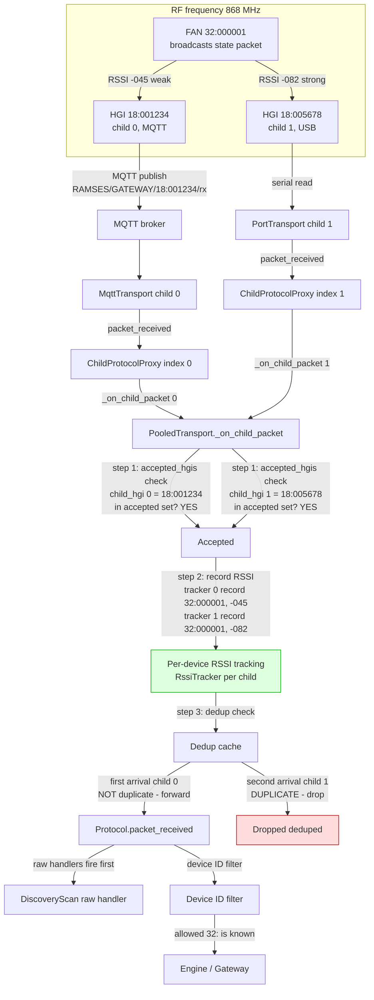

# Inbound: device sends a packet, two HGIs hear it

## Key points

- Both HGIs hear the same RF packet with different RSSI due to distance
- Pool records per-device RSSI via `RssiTracker.record()` — one tracker per child
- `accepted_hgis` checks the **child's** HGI, not the packet source
- Dedup: first arrival forwarded, second dropped
- Scan engine sees it via raw handler before device filter
- Only one packet reaches the engine — no duplicate processing
