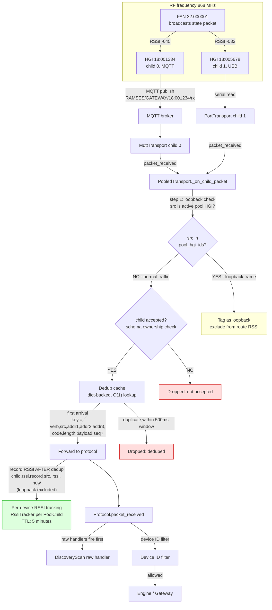

# Inbound: device sends a packet, two HGIs hear it

## Key points (new plan)

- Both HGIs hear the same RF packet with different RSSI due to distance
- **Loopback check first**: if src is an active pool HGI, tag as loopback and exclude from route RSSI (invariant 15)
- **Schema ownership** is canonical for acceptance (not a separate `accepted_hgis` set)
- **Dedup is dict-backed** (O(1) lookup), key includes sequence when present (resolved from fixtures: sequence is stable across HGIs, 50/50)
- **RSSI recorded after dedup** — only for non-loopback packets, preventing aggregate contamination
- **RSSI TTL: 5 minutes** — stale samples expire automatically (resolved from fixtures)
- **500 ms dedup window** confirmed from fixtures (median delta 8.4 ms)
- Inbound frames retain receiving-HGI provenance independently from `addr1` (invariant 8)
