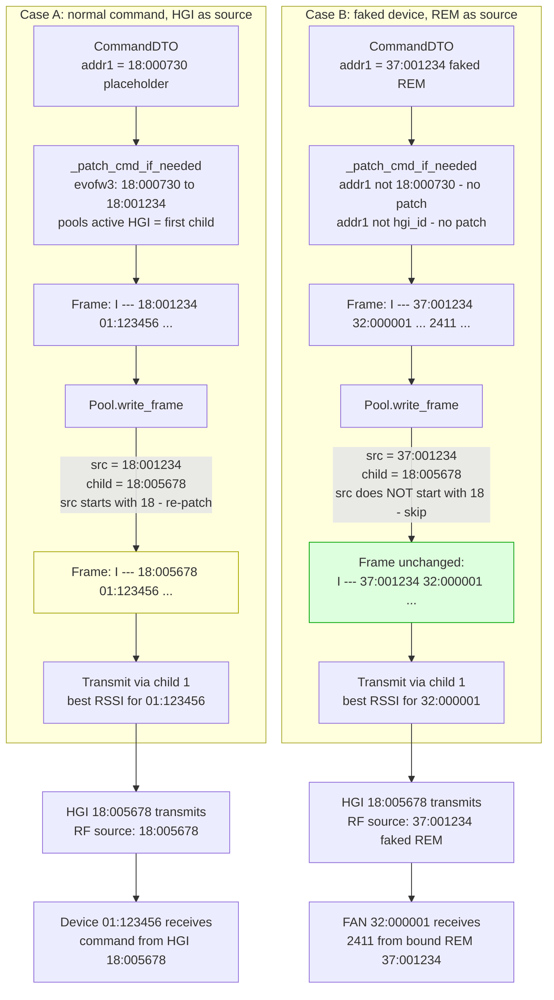

# Outbound: send a command to the FAN

Normal command (HGI as source) vs faked device (REM as source).

## Key points

- Protocol patches addr1 to pool's active HGI (first child) — first patch
- Pool parses frame via `.split()`, target = parts[3] (addr2)
- Pool looks up `tracker.best_rssi_for(target)` — max of last N readings
- Pool re-patches addr1 to selected child's HGI — second patch
- Re-patch only when `src_addr starts with 18` (HGI source)
- Faked devices preserved: 37:001234 (REM) is NOT re-patched
- HGI80 exception: 18:000730 placeholder is NOT re-patched
- Double-patch is not optimal but overhead is negligible — see future optimization comment
