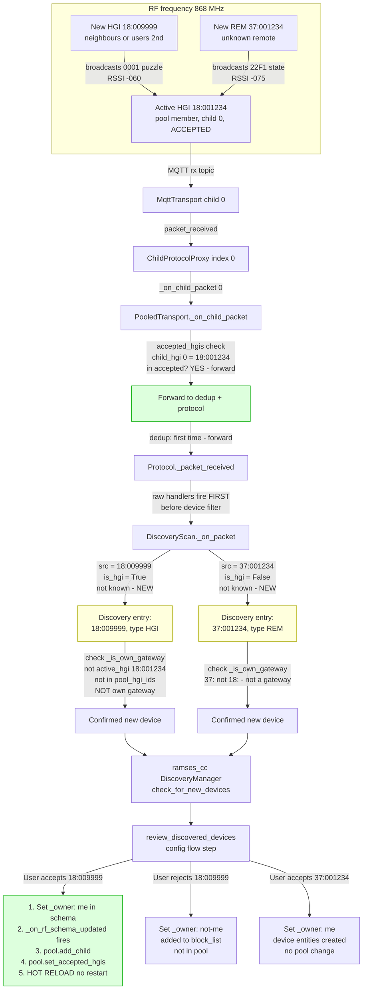

# Discovery: new HGI or REM detected

## Key points

- `accepted_hgis` filters by which child received the packet, not by packet source
- Packets from a new HGI are forwarded if heard by an accepted pool member
- Scan engine sees them via raw handler and creates discovery entries
- `_is_own_gateway` checks `pool_hgi_ids` — existing members not re-discovered
- Accept triggers hot-reload via `_on_rf_schema_updated`
