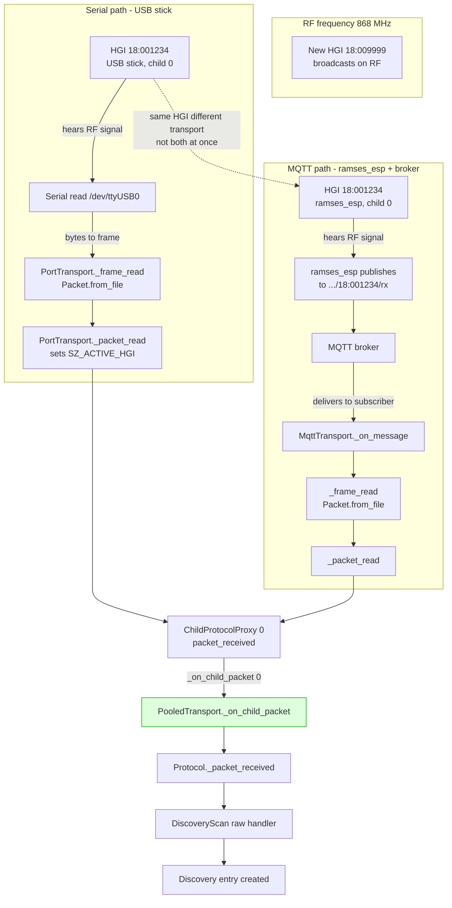

# Transport transparency: serial vs MQTT vs Zigbee

## Transport comparison

| Transport | RF receiver | Delivery to pool |
|---|---|---|
| Serial USB | USB stick | Serial bytes to frame to Packet |
| MQTT ramses_esp | ramses_esp radio | MQTT publish to broker to subscriber to Packet |
| Zigbee | Zigbee coordinator radio | Zigbee cluster attr to Packet |

All three converge at `_packet_read` to `ChildProtocolProxy` to
`pool._on_child_packet` to `Protocol._packet_received` to raw handlers
to `DiscoveryScan._on_packet`. The pool treats all children the same.
