# Adding a new serial USB gateway to the pool

Serial has a bootstrapping problem: the scan engine knows a new HGI ID
exists from RF, but not which physical port it is on.

```mermaid
flowchart TD
    subgraph Phase1["Phase 1: Detection - same as MQTT"]
        NewHGI["New HGI 18:009999<br/>broadcasts on RF"]
        ExistingHGI["Existing HGI 18:001234<br/>child 0, /dev/ttyUSB0"]
        NewHGI -->|"RF signal"| ExistingHGI
        ExistingHGI --> PortTransport0["PortTransport child 0"]
        PortTransport0 --> Proxy0["ChildProtocolProxy 0"]
        Proxy0 --> Pool1["Pool._on_child_packet"]
        Pool1 --> Proto1["Protocol._packet_received"]
        Proto1 --> Scan1["DiscoveryScan raw handler"]
        Scan1 -->|"src 18:009999 not in pool_hgi_ids"| Entry1["Discovery entry: 18:009999"]
        Entry1 --> Review1["review_discovered_devices"]
        Review1 --> Accept1["User accepts<br/>_owner: me in schema"]
        Accept1 --> Note1["BUT: unknown which port<br/>18:009999 is on<br/>Cannot add to pool yet"]
    end

    subgraph Phase2["Phase 2: Adding to pool - serial specific"]
        Plug["User plugs in USB stick<br/>at /dev/ttyUSB1"]
        Plug --> Menu["Manage Gateway Pool<br/>Add Gateway"]
        Menu --> PortList["Port picker shows<br/>/dev/ttyUSB0 in use<br/>/dev/ttyUSB1 available"]
        PortList --> Select["User selects /dev/ttyUSB1"]
        Select --> AddChild["coordinator:<br/>pool.add_child /dev/ttyUSB1"]

        AddChild --> Factory["_create_single_child<br/>proxy, port /dev/ttyUSB1"]
        Factory --> PortTrans["PortTransport created<br/>for /dev/ttyUSB1"]

        PortTrans --> Handshake["Signature handshake<br/>send 0001 puzzle<br/>wait for echo"]
        Handshake -->|"HGI echoes back<br/>0001 with its ID as src"| Echo["Echo received<br/>packet.src.id = 18:009999"]
        Echo --> SetHgi["PortTransport._packet_read<br/>SZ_ACTIVE_HGI = 18:009999"]
        SetHgi --> MakeConn["_make_connection<br/>protocol.connection_made"]

        MakeConn --> ProxyConnected["ChildProtocolProxy.connection_made<br/>pool._on_child_connected 1"]
        ProxyConnected --> PoolConnected["Pool:<br/>child_hgi 1 = 18:009999<br/>child_connected 1 = True<br/>child_rssi_trackers 1 = RssiTracker"]

        PoolConnected --> CrossRef["Cross-reference:<br/>18:009999 accepted in Phase 1<br/>pool.set_accepted_hgis"]
        CrossRef --> Done["Pool has 2 children:<br/>child 0: /dev/ttyUSB0 to 18:001234<br/>child 1: /dev/ttyUSB1 to 18:009999<br/>RSSI routing active"]
    end

    Accept1 --> Plug

    style Note1 fill:#fdd,stroke:#c00
    style Done fill:#dfd,stroke:#0a0
    style Echo fill:#ffd,stroke:#aa0
```

## MQTT vs Serial comparison

| Aspect | MQTT | Serial |
|---|---|---|
| HGI ID known before adding? | Yes from scan engine | No, only after handshake |
| URL format | mqtt://broker/.../18:009999 | /dev/ttyUSB1 |
| How HGI ID discovered | ramses_esp topic path | 0001 puzzle echo src.id |
| Can accept directly? | Yes, construct URL | No, need physical port first |
