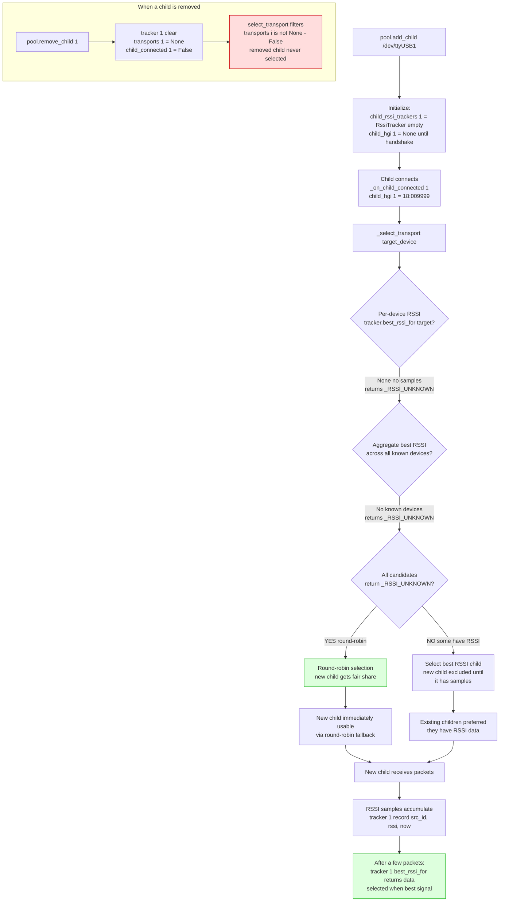

# RSSI when a new HGI is added or removed

## Key points

- New child gets a fresh `RssiTracker` — no initialization needed
- Immediately usable via round-robin fallback
- Naturally transitions to RSSI-based selection as samples accumulate
- Removed child: `tracker.clear()` frees memory, `is not None` check excludes from selection
- Fallback chain: per-device `best_rssi_for` → aggregate best → round-robin
